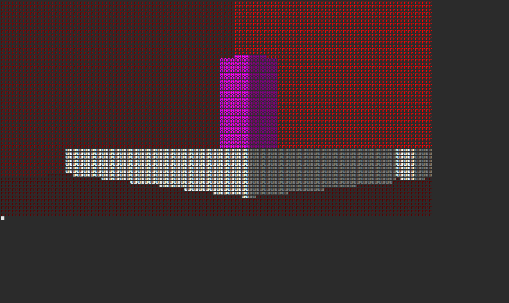
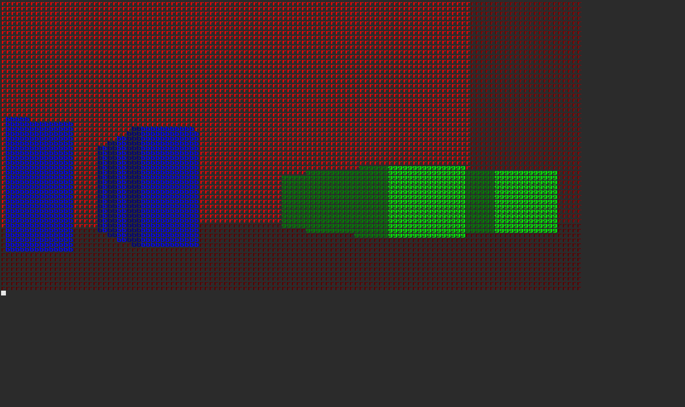

# Ascii Raycaster

A 3d raycaster that renders to ASCII text.

## Controls

- `i` and `k` to move forward and back
- `j` and `l` to look left and right
- `o` and `u` to look up and down

That's all.

## Why render to ASCII?

Because it's cool.

In all seriousness, I decided to make this because my brother was playing around
with raycasting. I stumbled across a roguelike thread debating the merits of
tilesets vs ASCII, and one point was that ASCII was easily identifiable. The two
ideas just collided in my head and here we are.

One side effect of using ASCII is that the number of "characters" that I have to
raycast is significantly reduced. You would get the same effect with larger
pixels, but when I add game objects that need to be discerned from each other,
ASCII should let me use a lower resolution.

## Future Plans

- Move to custom "grid-of-text" renderer

## Links that I used

<http://lodev.org/cgtutor/raycasting.html>

<http://9bitscience.blogspot.com/2013/07/raymarching-distance-fields_14.html>

<http://permadi.com/1996/05/ray-casting-tutorial-table-of-contents/>

[Wikipedia. Lots of wikipedia, on vectors, rotation, and matrices.](https://en.wikipedia.org/)

[Voxel Quest][voxel-quest]

[voxel-quest]: http://www.voxelquest.com/

